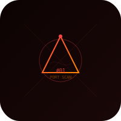

# 60SEPP — Security Engineering Projects Portfolio

<div align="center">
  
</div>

<p align="center">
  
  
  
</p>

Private collection of offensive security tools built from scratch for authorized pentesting, CTF competitions, and security research. Each project includes a step-by-step BUILD_GUIDE explaining how and why it was made.

## Projects

| # | Project | Description | Status |
|---|---------|-------------|--------|
| 01 | [Port Scanner](projects/01-port-scanner/) | Async TCP port scanner with banner grabbing | Done |

## Structure

Every project follows the same layout:

```
projects/NN-project-name/
├── README.md           # What it does + how to use it
├── BUILD_GUIDE.md      # Step-by-step "how this was built" curriculum
├── CMakeLists.txt      # Build config (or Makefile/setup.py depending on lang)
├── main.cpp            # Entry point
└── src/                # Source files
```

## Target Environment

- Kali Linux (rolling)
- Built for authorized security testing only
